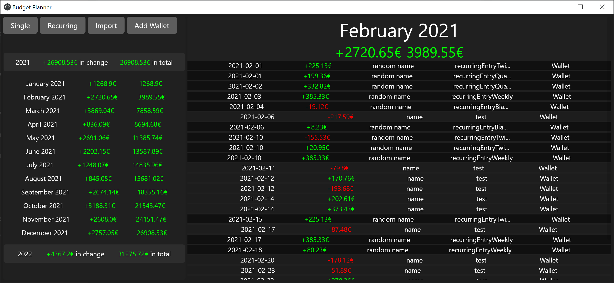
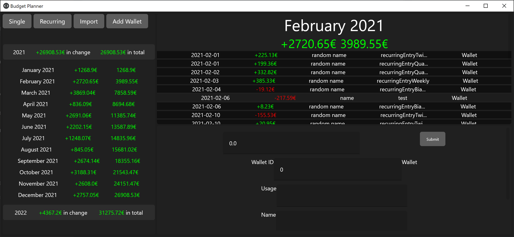
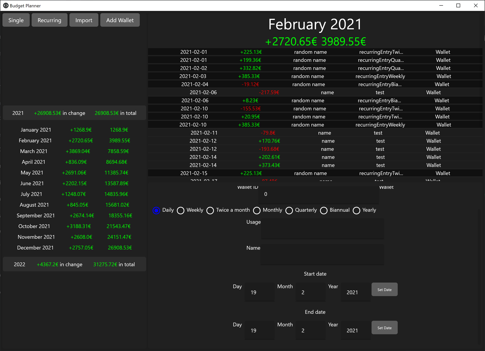
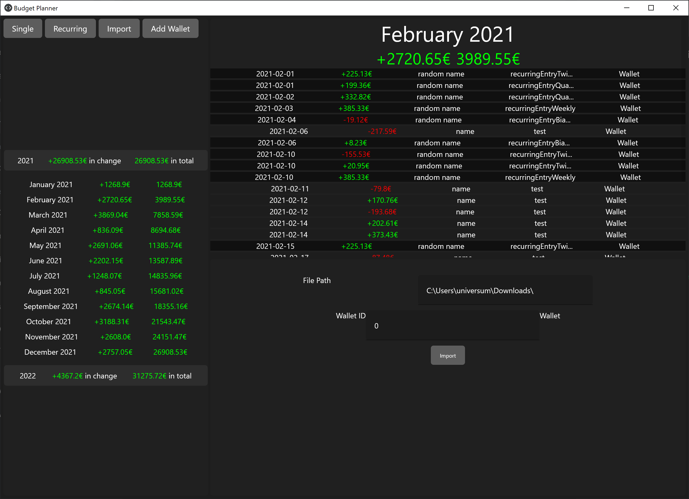
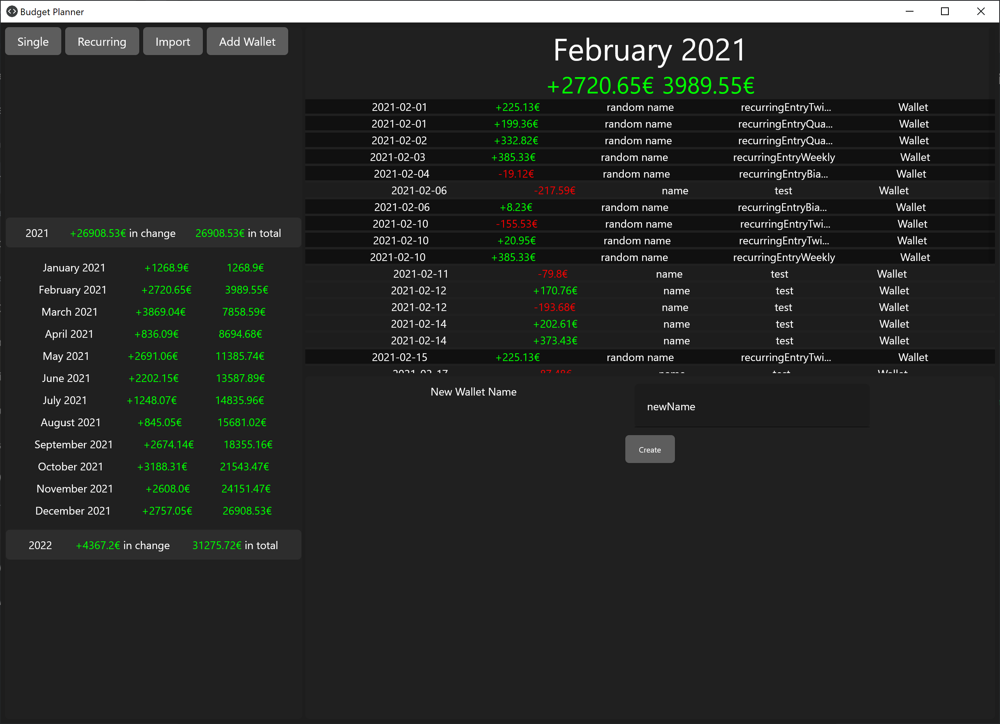

# Budget Planner - <small> a  simple tool to keep track of all your expenses and income</small>

This small and simple tool, written in Kotlin, uses the Jetbrains Compose GUI library (currently in alpha), which is based on the Android UI development in "Jetpack Compose". This application in designed for the JVM in a desktop environment, though with some small fixes you should be able to port it into a multiplatform application. 

## General
All data, whether imported or manually added, will be stored in a file called "data.json" in the same location as the .jar file. Every time you start your application a backup will be created into "./backups", the newly created file will be called "backup-" + the current epoch second + "json". If you want to restore a backup just delete the old "data.json" and move the file you want to restore to the old location of "data.json" and change the filename.

## Simple UI

The app consists of three main elements:
- menubar (top left)
- "balance list" (left)
- "month overview" (right)
- (subwindow) (bottom right)

With the Menubar you can select the actions ypu want to perform in a subwindow, like add entries, import entries and add locations, you want to separately register.
On the left side, there is a list of every year, an entry is registered in the application, with the change of money in this year and the remaining money at the end of the year. By clicking on one of these rows, a "dropdown" menu will appear so you can view your expenses more detailed, per month. If You want more details, click on one month and it will display more information on the right-hand side of the application. By default, the current year will be already expanded and the current month selected in the overview. 
You can delete entries by clicking on them, a button with "delete" will appear and you can delete the entry from the list.
Recurring entries will be displayed in a slightly darker color.

### Add single entry

When selecting the "Single" button in the menu bar, you can manually add a "one-time" entry. You type the amount, the wallet id, the entry should be connected to (the corresponding name is displayed next to the id input field), a usage, a name and a transaction date. At the end hit "Submit" and the entry will appear in your list.

### Add recurring entry

When selecting the "Recurring" button in the menu bar, you can add a recurring entry. Same procedure as in "Add single Entry", you give the amount, the usage, a name, the interval, the entry should be repeated, at start date (the first time the entry should be planned) and the end date, hit "Submit" and the entry will appear in your list.

### Import data

For easier usage you can "connect" your bank account with the program. In my case, I can export all transactions into a simple csv file. To import these transactions into the application, open the "import" subwindow, type the corresponding filepath into the given Inputfield, select a wallet, the entries should be connected to and hit "Submit". Currently there is only one format, that can be imported "CSV-CAMT-Format" other formats and own formats will be implemented eventually.

### Add Wallet

You cann add a new wallet in the "Add wallet" menu, just enter a new name and the new location will be saved
